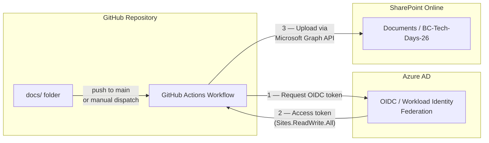
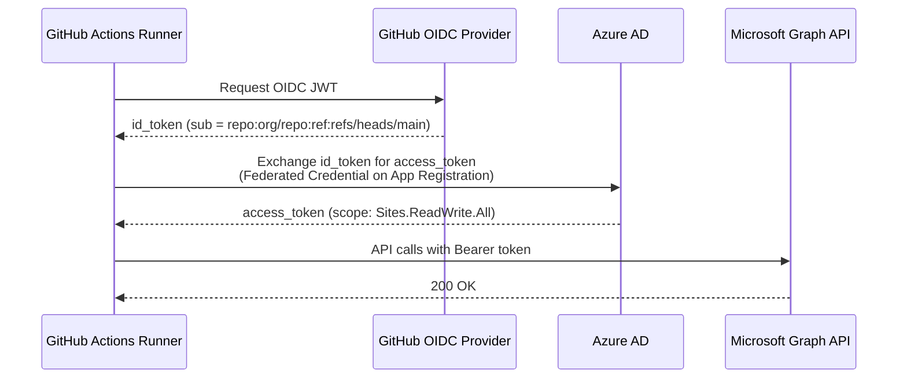
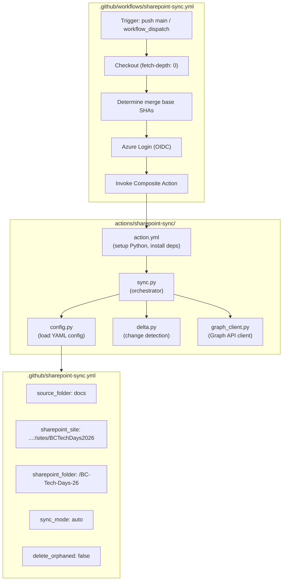
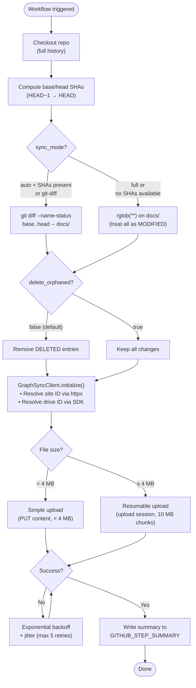
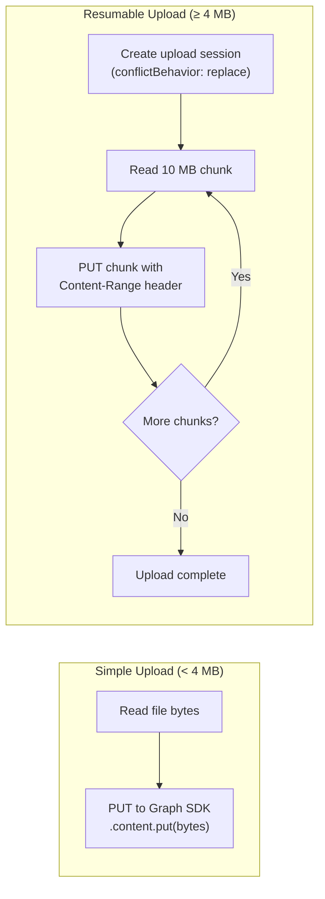
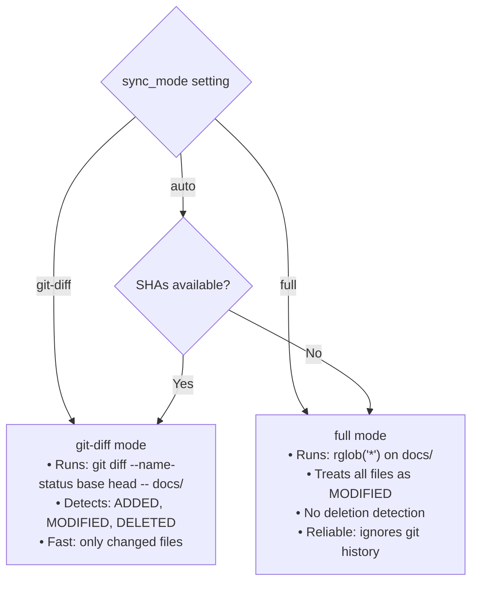
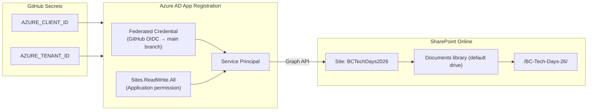

# SharePoint Document Sync — Technical Architecture

> Automatic file synchronization from the `docs/` repository folder to a SharePoint Online document library via GitHub Actions, OIDC authentication, and Microsoft Graph API.

---

## 1. High-Level Overview



---

## 2. Authentication Flow



**Key details:**
- **App Registration**: `GitHub-SharePoint-Sync` (Client ID: `89200c80-...`)
- **Permission**: `Sites.ReadWrite.All` (Application — admin-consented)
- **Federated Credential Subject**: `repo:AL-Copilot-Skills-Collection/BC-Tech-Days-26:ref:refs/heads/main`
- **No secrets stored** — OIDC token exchange eliminates long-lived credentials

---

## 3. Component Architecture



---

## 4. Sync Workflow — Step by Step



---

## 5. File Upload Detail



**Remote path construction:**
```
Drive root (Documents library)
  └─ /BC-Tech-Days-26/           ← sharepoint_folder
      └─ subfolder/              ← preserves repo structure
          └─ file.md             ← uploaded file
```

Graph API auto-creates intermediate folders via the `root:/path/to/file:` notation.

---

## 6. Delta Detection Modes



| Mode | Speed | Detects Deletions | Use Case |
|---|---|---|---|
| `auto` | Adaptive | When SHAs present | Default — best of both |
| `git-diff` | Fast | Yes | CI push events |
| `full` | Slower | No | Manual re-sync, first run |

---

## 7. Infrastructure & Security



**Security posture:**
- No client secrets — OIDC only
- Federated credential scoped to `main` branch only
- `Sites.ReadWrite.All` is the minimum permission for SharePoint file upload
- Additive-only sync (`delete_orphaned: false`) — never deletes from SharePoint

---

## 8. Dependencies

| Package | Purpose |
|---|---|
| `azure-identity >=1.17.0` | `DefaultAzureCredential` / OIDC token exchange |
| `msgraph-sdk >=1.5.0` | Microsoft Graph SDK (site/drive resolution, simple upload) |
| `httpx >=0.27.0` | Direct HTTP for site resolution + resumable upload chunks |
| `PyYAML >=6.0.1` | Parse `.github/sharepoint-sync.yml` config |

---

## 9. Configuration Reference

```yaml
# .github/sharepoint-sync.yml
source_folder: "docs"                    # Repo folder to sync
sharepoint_site: "host:/sites/SiteName"  # SharePoint site (hostname:/path)
sharepoint_folder: "/BC-Tech-Days-26"    # Path inside the Documents library
delete_orphaned: false                   # Never delete from SharePoint
sync_mode: "auto"                        # auto | git-diff | full
# file_patterns:                         # Optional glob filter
#   - "**/*.md"
```
