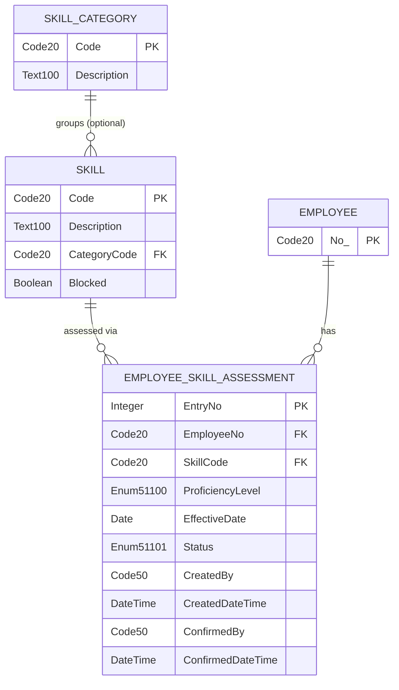

# ARCH-001 — Employee Skill Catalog and Skill Profile Management

> This document is the architectural rationale companion to [SPEC-001](../specs/employee-skill-catalog-and-profile.spec.md).
> The spec says **what** to build — object IDs, field definitions, page layouts, acceptance criteria.
> This document says **why** the design is structured this way — drivers, ADRs, component boundaries, runtime flows, and known constraints.
> When the spec and this document disagree, this document governs the *intent*; the spec governs the *detail*.

---

## Context
<!-- section-key: Context -->

### 1.1 Business context

BC Tech Days 2026 needs a structured way to record and audit employee competencies inside Business Central. HR administrators must be able to define a central skill catalog, record each employee's proficiency level against catalog entries with an effective date, and preserve every historical assessment permanently. Employees need a self-service path to propose their own skill levels, subject to HR or line-manager confirmation before the assessment is considered authoritative.

The primary business value is a single, auditable, time-stamped record of workforce competencies that survives the inevitable reality of assessments being updated, corrected, or challenged over time.

### 1.2 Technical context

- **Platform**: Microsoft Dynamics 365 Business Central, application version 22.0.0.0, runtime 15.2
- **Extension**: "Employee Skill Management" (ESM), publisher "BC Tech Days 2026", object ID range 51100–51149
- **Feature flag**: `NoImplicitWith` enabled — all variable access must be explicit
- **No existing ESM objects** in the repository; this is a greenfield extension
- **Standard BC anchor object**: Employee (Table 5200) and Employee Card (Page 5200) — extended via PageExtension only; no modifications to standard objects

### 1.3 Scope of this architecture

**In scope**

- Enums 51100–51101 (proficiency scale, assessment status)
- Tables 51100–51102 (Skill, Skill Category, Employee Skill Assessment ledger)
- Pages 51100–51104 and PageExtension 51100
- Codeunit 51100 (Skill Mgt.)
- Permission Sets 51100–51101 (ESM BASIC, ESM FULL)
- The confirmation workflow: employee-entered Pending rows → manager Confirm → Confirmed status

**Out of scope**

- Development goal linkage (US-002)
- Performance review skill snapshots (US-003)
- Configurable proficiency scale (future story)
- Assessment correction/retraction mechanism (future story)
- Telemetry / Application Insights instrumentation
- API pages or external integration endpoints

---

## Architectural drivers
<!-- section-key: ArchitecturalDrivers -->

| # | Driver | Source | Implication |
|---|---|---|---|
| D-1 | Assessment records must never be modified or deleted after creation | US-001 AC4, SPEC §2.2 | Table 51102 must be append-only; immutability must be enforced unconditionally at the table level, not only at the UI level |
| D-2 | "Current" proficiency must be derived from effective-dated history, not stored separately | US-001 AC3, SPEC §2.1 | On-demand calculation via codeunit; no denormalised current-value field or FlowField |
| D-3 | Employee self-service entries must not affect reported current proficiency until an authorised user confirms them | US-001 AC2, SPEC §2.2 (OQ2) | A status dimension (Pending / Confirmed) is required on every assessment row; GetCurrentProficiency must filter to Confirmed only |
| D-4 | Skill catalog must prevent deletion of skills referenced by any assessment | US-001 AC1, SPEC §3.1 | OnBeforeDelete guard on Table 51100 must consult Table 51102 before allowing deletion |
| D-5 | ConfirmAssessment must update an otherwise-immutable row | SPEC §4 (ConfirmAssessment) | A dedicated write path is required that bypasses the immutability trigger; this path must itself be access-controlled |
| D-6 | The extension must not modify any standard BC object | SPEC §7, BC SaaS extension rules | All touches to Employee Card (5200) must be via PageExtension; no table or codeunit modifications |

---

## Architectural style and key decisions
<!-- section-key: ArchitecturalStyleAndDecisions -->

The extension follows the **master-data / append-only ledger** pattern well-established in standard BC (analogous to Item Ledger Entry, G/L Entry): a master table (Skill) validates references, and a transaction table (Employee Skill Assessment) records every event chronologically with no modification or deletion.

Business logic is concentrated in a single management codeunit (Skill Mgt. 51100), following the BC "codeunit as service" pattern. Pages are thin — they display data and delegate writes to the codeunit. This keeps validation testable without a UI.

### ADR-1 — Append-only ledger for Employee Skill Assessment

- **Context**: AC4 demands that no prior assessment can ever be overwritten or removed. The simplest BC mechanism is to raise an error in `OnBeforeModify` and `OnBeforeDelete`. Alternatives such as a soft-delete flag or a version-stamp guard were considered. Driver: D-1.
- **Decision**: Table 51102 (`Employee Skill Assessment`) has unconditional errors in both `OnBeforeModify` and `OnBeforeDelete`. There is no override flag. The only write path for ordinary assessments is `AddSkillAssessment` via an insert; the only legitimate state change after insert is the Pending → Confirmed transition handled by `ConfirmAssessment` through a separate bypass mechanism (see ADR-3).
- **Consequence**: Immutability is guaranteed at the database trigger level, making it impossible to bypass from any page, API page, or external OData call. The design introduces a deliberate tension with the confirmation use case, which is resolved by ADR-3. Future stories that need to "correct" an assessment must implement a counter-entry pattern (a new row with a corrective annotation), not a modification of the original.
- **Alternatives rejected**: *Soft-delete / Corrected flag* — a flag-based approach relies on every query respecting the flag; a single unfiltered read would silently expose "deleted" data. *Version-stamp guard* — adds complexity without stronger immutability guarantees; still allows overwrites by privileged callers.

### ADR-2 — On-demand proficiency calculation via codeunit

- **Context**: The "current proficiency" per employee+skill is a derived value from Table 51102. It could be stored as: (a) a FlowField on a separate profile table, (b) a dedicated "current" row in a second table kept synchronised with the ledger, or (c) computed on demand by a codeunit. Drivers: D-2, D-3.
- **Decision**: `GetCurrentProficiency` in Codeunit 51100 computes the current value on demand: filter Table 51102 on (Employee No., Skill Code, Effective Date ≤ AsOfDate, Status = Confirmed), use secondary key `(Employee No., Skill Code, Effective Date)`, `FindLast`, return Proficiency Level. `SetLoadFields` limits the read to Proficiency Level and Effective Date.
- **Consequence**: No stale data is possible since there is nothing to synchronise. The Confirmed-only filter means Pending entries are silently excluded — this is the intended behavior for D-3. The secondary key makes the lookup O(log n) in effective-date entries per employee+skill. Page 51103 displays all rows (Pending and Confirmed) so the employee can see their pending entries; `GetCurrentProficiency` is invoked only where an authoritative current value is needed.
- **Alternatives rejected**: *FlowField* — BC FlowField cannot simultaneously filter on multiple fields (Status AND Effective Date range) in a single definition without a BLOB key workaround. *Separate "current" table* — introduces a synchronisation obligation; a concurrent insert could produce an inconsistent read window; violates the single-source-of-truth principle of the ledger.

### ADR-3 — ConfirmAssessment bypass via ModifyAll on primary key

- **Context**: `ConfirmAssessment` must transition a row from `Pending Confirmation` to `Confirmed` by writing Status, Confirmed By, and Confirmed DateTime. Table 51102's `OnBeforeModify` blocks all modifications. Drivers: D-1, D-5.
- **Decision**: `ConfirmAssessment` uses `ModifyAll` on a Table 51102 variable filtered to the exact `Entry No.` (the PK). `ModifyAll` in AL does not invoke the per-record `OnBeforeModify` trigger. Three separate `ModifyAll` calls handle the three fields. The procedure is `internal` access within Codeunit 51100 and validates that the row exists and its current Status is `Pending Confirmation` before proceeding. The calling page action (Page 51103) checks `UserHasESMFullPermission()` before making the call.
- **Consequence**: Creates a single privileged write path that bypasses the immutability trigger with explicit intent. This path cannot be invoked from standard BC pages or OData because it is in an `internal` procedure. Future maintainers must not add a second `ModifyAll` bypass without a matching ADR. The approach depends on AL's documented behavior that `ModifyAll` does not fire per-record triggers — this is a stable BC platform contract.
- **Alternatives rejected**: *`SkipTriggers` flag on a local variable* — requires `SECURITY FILTER IGNORED` permission in some deployments; fragile across runtime version changes. *Delete + re-insert as Confirmed* — creates a gap in the Entry No. sequence and violates the spirit of immutability (the original insert record disappears). *Separate "confirmation" table* — adds a join to every proficiency query; over-engineering for a two-state workflow.

### ADR-4 — Inline editable ListPart with permission-driven InitialStatus

- **Context**: Employees and HR users both need to add assessments from the Employee Card. Two UX models were considered: a dialog page (a separate card page opened from an action) or inline editing in the ListPart FactBox. Driver: D-3, OQ4 resolved.
- **Decision**: Page 51103 (`Employee Skill Profile`) is an inline editable ListPart. `OnBeforeInsert` checks whether the inserting user has the ESM FULL permission set; if yes, `InitialStatus = Confirmed`; if no, `InitialStatus = Pending Confirmation`. The call to `AddSkillAssessment` in the codeunit then receives the pre-determined status. Pending rows are rendered in the Ambiguous (orange) style via `StyleExpr` to distinguish them visually.
- **Consequence**: UX friction is minimal for HR users — they enter a row and it is immediately Confirmed. Employee self-service users see their row appear in orange, signalling it awaits confirmation. The page's `OnBeforeInsert` must be the sole decision point for `InitialStatus`; the codeunit `AddSkillAssessment` is agnostic about who the caller is.
- **Alternatives rejected**: *Dialog page (Page 51105)* — extra navigation step for the common HR case; removed from scope by OQ4 resolution. *Single permission check at the page action level only* — does not cover API page inserts or test codeunit inserts; the `OnBeforeInsert` placement is more robust.

### ADR-5 — Permission-set-based role distinction without a custom user setup table

- **Context**: ESM BASIC users can view and propose; ESM FULL users can confirm and manage the catalog. This distinction needs to be enforced at both the data layer and the UI layer. A custom user-role table was considered. Drivers: D-3, D-6.
- **Decision**: Two standard BC permission sets (ESM BASIC 51100, ESM FULL 51101) define the access boundary. Page 51103 uses a Boolean variable `IsESMFull` populated in `OnOpenPage` via a helper that checks whether the current user holds ESM FULL. The Confirm action's `Visible` property and the `InitialStatus` logic both read this variable. No custom user setup table is required for v1.
- **Consequence**: Role assignment is managed through standard BC user management (Role Center, User Group, or direct permission set assignment). The permission check is a UI-level guard — a developer calling `ConfirmAssessment` directly from a test codeunit can bypass the page check (see Constraint C-5). The helper procedure `UserHasESMFullPermission` must be a named, tested procedure in Codeunit 51100 to be reusable across pages.
- **Alternatives rejected**: *Hardcoded User No. or Role Center check* — not portable across environments; breaks multi-company deployments. *Setup table flag "Require confirmation"* — over-engineering for v1; the confirmation requirement is a hard functional requirement, not a configurable option.

---

## Logical component view
<!-- section-key: LogicalComponentView -->

```
┌─────────────────────────────────────────────────────────────────┐
│                   Business Central Client                        │
│                                                                   │
│  ┌────────────────────────────────────────────────────────────┐  │
│  │  Employee Card (Page 5200) — STANDARD, unchanged           │  │
│  │  └─ PageExtension 51100 (Employee Card ESM Ext)            │  │
│  │       ├── FactBox ──► Page 51103 Employee Skill Profile    │  │
│  │       └── Action  ──► Page 51104 Skill Assessment History  │  │
│  └────────────────────────────────────────────────────────────┘  │
│                                                                   │
│  ┌────────────────────────────────────────────────────────────┐  │
│  │  Skill Catalog UI                                          │  │
│  │  Page 51100 Skill List  │  Page 51101 Skill Card           │  │
│  │  Page 51102 Skill Category List                            │  │
│  └────────────────────────────────────────────────────────────┘  │
└─────────────────────────────────────────────────────────────────┘
                            │ delegates writes
                            ▼
         ┌──────────────────────────────────────┐
         │       Codeunit 51100 — Skill Mgt.     │
         │  AddSkillAssessment                   │
         │  GetCurrentProficiency                │
         │  ConfirmAssessment  (internal bypass) │
         │  BlockSkill                           │
         │  CanDeleteSkill                       │
         │  UserHasESMFullPermission             │
         └─────┬──────────────┬─────────────────┘
               │              │
    ┌──────────▼──┐   ┌───────▼──────────────────────┐
    │ Table 51100 │   │ Table 51102                   │
    │ Skill       │   │ Employee Skill Assessment     │
    │             │   │ (append-only ledger)          │
    └──────┬──────┘   └────────────┬──────────────────┘
           │                       │ FK
    ┌──────▼──────┐    ┌───────────▼────────────────┐
    │ Table 51101 │    │ Employee (5200) — STANDARD  │
    │ Skill Cat.  │    │ FK reference only           │
    └─────────────┘    └────────────────────────────┘
```

### 4.1 Component responsibilities

| Component | Responsibility | Does NOT do |
|---|---|---|
| Codeunit 51100 Skill Mgt. | All business logic: validation, insert, status transition, current-proficiency derivation | Display data; check navigation permissions; manage page state |
| Table 51102 | Persist assessment rows; enforce immutability via triggers; auto-set audit fields in `OnBeforeInsert` | Compute derived values; enforce role-based access |
| Table 51100 Skill | Persist catalog master; enforce delete guard | Track employee assessments |
| Page 51103 Employee Skill Profile | Display all assessment rows for one employee (including Pending); set `InitialStatus` in `OnBeforeInsert`; surface Confirm action to ESM FULL users | Compute current proficiency for display — delegates to `GetCurrentProficiency` |
| PageExtension 51100 | Surface skill data on Employee Card FactBox; add Skill History navigation | Modify any existing Employee Card fields or triggers |
| Permission Sets 51100/51101 | Define read-only (BASIC) and read+insert (FULL) access boundaries | Enforce business workflow rules (that is the codeunit's job) |
| Employee (5200) | Standard BC employee master | Part of this extension — unchanged |

---

## Key runtime flows
<!-- section-key: KeyRuntimeFlows -->

### 5.1 HR/manager adds a skill assessment

```
HR user opens Employee Card
      │
      ▼
PageExtension 51100 renders Page 51103 in FactBox
(IsESMFull = true; OnOpenPage sets flag)
      │
HR user enters new row inline
(Skill Code, Proficiency Level, Effective Date)
      │
      ▼
Page 51103 OnBeforeInsert
  └─► InitialStatus = Confirmed  (IsESMFull = true)
  └─► calls Codeunit 51100.AddSkillAssessment(
              EmployeeNo, SkillCode, ProfLevel, EffDate, Confirmed)
            │
            ├─ Validate: Employee exists?         → error if not
            ├─ Validate: Skill exists?             → error if not
            ├─ Validate: Skill.Blocked = false?    → error if blocked
            ├─ Validate: ProfLevel ≠ Unassigned?   → error if unassigned
            └─ Insert row in Table 51102 (Status = Confirmed)
      │
      ▼
FactBox refreshes — new row visible, no orange styling
```

### 5.2 Employee self-service adds a pending assessment

```
Employee opens Employee Card
(IsESMFull = false; OnOpenPage sets flag)
      │
Employee enters new row inline
      │
      ▼
Page 51103 OnBeforeInsert
  └─► InitialStatus = Pending Confirmation  (IsESMFull = false)
  └─► calls Codeunit 51100.AddSkillAssessment(
              EmployeeNo, SkillCode, ProfLevel, EffDate, PendingConfirmation)
            └─ Insert row in Table 51102 (Status = Pending Confirmation)
      │
      ▼
FactBox refreshes — new row visible in Ambiguous (orange) style
Confirm action is NOT visible to employee
```

### 5.3 Manager confirms a pending assessment

```
Manager opens Employee Card
(IsESMFull = true)
      │
Manager sees orange Pending row in FactBox
Manager selects row, invokes Confirm action
      │
      ▼
Page 51103 Confirm action
  └─► checks IsESMFull — proceeds if true
  └─► calls Codeunit 51100.ConfirmAssessment(EntryNo)
            │
            ├─ Retrieve row by Entry No.            → error if not found
            ├─ Check Status = Pending Confirmation  → error if already Confirmed
            └─ ModifyAll(Status = Confirmed)
               ModifyAll(Confirmed By = UserId)
               ModifyAll(Confirmed DateTime = CurrentDateTime)
               [no OnBeforeModify trigger fires — ADR-3]
      │
      ▼
FactBox refreshes — row now appears without orange styling
GetCurrentProficiency will now include this row in future lookups
```

### 5.4 GetCurrentProficiency lookup

```
Caller (page OnAfterGetRecord or codeunit)
  └─► Codeunit 51100.GetCurrentProficiency(
              EmployeeNo, SkillCode, AsOfDate)
            │
            ├─ SetRange Employee No. = EmployeeNo
            ├─ SetRange Skill Code = SkillCode
            ├─ SetRange Status = Confirmed
            ├─ SetFilter Effective Date ≤ AsOfDate
            ├─ SetCurrentKey (Employee No., Skill Code, Effective Date)
            ├─ SetLoadFields (Proficiency Level, Effective Date)
            └─ FindLast
                 ├─ Found    → return Proficiency Level
                 └─ Not found → return Unassigned
```

### 5.5 Skill deletion guard

```
User requests delete on Skill (Table 51100) from Page 51100
      │
      ▼
Table 51100 OnBeforeDelete
  └─► calls Codeunit 51100.CanDeleteSkill(SkillCode)
            │
            ├─ SetRange Skill Code = SkillCode on Table 51102
            ├─ IsEmpty?
            │     ├─ true  → return true (delete allowed)
            │     └─ false → Error('Skill %1 has assessment history…')
      │
      ▼
Delete proceeds only if no assessments reference the skill
```

---

## Data architecture
<!-- section-key: DataArchitecture -->

### 6.1 Entity-relationship overview



### 6.2 Storage and ownership

| Object | Storage class | Owner | Lifecycle |
|---|---|---|---|
| Enum 51100 Skill Proficiency Level | Enum (metadata) | ESM extension | Exists while extension is installed; values are fixed in v1 |
| Enum 51101 Skill Assessment Status | Enum (metadata) | ESM extension | Exists while extension is installed |
| Table 51100 Skill | Master data | HR Administrator | Created, edited, blocked; never deleted if referenced |
| Table 51101 Skill Category | Master data | HR Administrator | Created, edited; never deleted if referenced |
| Table 51102 Employee Skill Assessment | Ledger (append-only) | ESM extension | Rows are created; never modified or deleted by business logic |
| Permission Sets 51100/51101 | Security metadata | System Administrator | Assigned to users/user groups at deployment |

### 6.3 Key derivation

- **Table 51100 Skill**: natural primary key `Code` (Code[20]) — HR admins assign meaningful codes (e.g. `SQL`, `EXCEL`, `PROJ-MGMT`); allows direct lookup and FK references without a surrogate key.
- **Table 51101 Skill Category**: natural primary key `Code` (Code[20]) — same rationale as Skill.
- **Table 51102 Employee Skill Assessment**: surrogate integer PK `Entry No.` — auto-incremented in `OnBeforeInsert` via `FindLast + 1` on the table. A natural composite key `(Employee No., Skill Code, Effective Date)` exists as a secondary key to support the `GetCurrentProficiency` query. The surrogate PK enables O(1) lookups in `ConfirmAssessment` and avoids multi-column FK references from future linked tables.

---

## Cross-cutting concerns
<!-- section-key: CrossCuttingConcerns -->

### 7.1 Security

- Two permission sets define the boundary: ESM BASIC (51100) grants `R` on all ESM objects; ESM FULL (51101) grants `R+I` on Table 51102 (no `M`, no `D` — enforced by table triggers).
- `ConfirmAssessment` is an `internal` procedure; it is not callable from outside Codeunit 51100. The calling page action checks `IsESMFull` before invoking it. A direct call from a test codeunit or a peer extension bypasses the page guard (see Constraint C-5).
- No custom authentication, no external API credentials, no secrets management in this story.
- Standard BC audit trail (`Created By`, `Created DateTime`, `Confirmed By`, `Confirmed DateTime`) covers the traceability requirement of AC4.

### 7.2 Reliability and error handling

- All validation in `AddSkillAssessment` raises user-facing errors with meaningful messages; no silent failures.
- `OnBeforeModify` and `OnBeforeDelete` on Table 51102 raise explicit errors — operators see a clear message, not an unexpected runtime exception.
- `ConfirmAssessment` errors if the target row does not exist or is already Confirmed — idempotency is not assumed.
- `CanDeleteSkill` returns a Boolean; `OnBeforeDelete` raises the error — keeping error-raising in the trigger where BC expects it.
- No background jobs or long-running transactions in this story; all operations are synchronous within the user's session.

### 7.3 Performance

- `GetCurrentProficiency` uses `SetCurrentKey` on secondary key `(Employee No., Skill Code, Effective Date)` and `SetLoadFields` to read only two fields. This is the critical path called on every Employee Card open.
- `CanDeleteSkill` uses `IsEmpty` (single-scan stop) rather than `Count`.
- No FlowFields are defined — all derived values are computed on demand, avoiding the cost of FlowField recalculation across unrelated record reads.
- For v1 HR headcounts, Table 51102 is expected to hold tens of thousands of rows at most; the secondary key is sufficient. Bulk-import scenarios are out of scope (see Constraint C-4).

### 7.4 Observability

Out of scope for this story. No telemetry codeunit or Application Insights event IDs are defined. The `bc-telemetry-generator` skill can add telemetry in a future story.

### 7.5 Localisation and translations

- All tables, pages, fields, enums, and actions must have `Caption` properties.
- All page fields must have `ToolTip` properties (XLF-exportable).
- The NAB AL Tools XLF workflow applies to all captions once the extension is compiled.
- Enum ordinal values (0=Confirmed, 1=Pending Confirmation) are stable; caption translations do not affect data storage.

### 7.6 RapidStart and portability

- Table 51100 (Skill) and Table 51101 (Skill Category) are suitable for RapidStart configuration packages: no blob fields, no system-computed fields that are mandatory for insert, no references to company-specific setup tables.
- Table 51102 (Employee Skill Assessment) is a transactional ledger — not typically exported via RapidStart. The `Entry No.` auto-increment must be reset on import if a package is used.

### 7.7 Upgrade and migration

- This is a new extension with no prior version; no upgrade codeunit is required for v1.
- If a future version adds fields to Table 51102, an upgrade codeunit (Subtype = Upgrade) must be introduced to populate default values for existing rows. The `bc-upgrade-codeunit-generator` skill covers this pattern.
- Enum values must never be renumbered between versions — ordinal values are persisted in the database. If a value is deprecated, mark it with a comment; do not reuse the ordinal.

---

## Coexistence with legacy HR module
<!-- section-key: CoexistenceWithLegacy -->

The ESM extension coexists with the standard BC HR module (Employee, Employee Card). The following table lists all standard objects touched by this extension and the nature of each touch:

| Standard object | Touched by | Nature of change |
|---|---|---|
| Employee Card (Page 5200) | PageExtension 51100 | One FactBox (Page 51103) added in the `FactBoxes` area; one action ("Skill History") added in the `Navigate` group. No fields added. No triggers modified. |
| Employee (Table 5200) | Table 51102 FK | `Employee No.` in Table 51102 carries `TableRelation: Employee.No.` — a UI-level foreign key only. No triggers or fields on Table 5200 are modified. |

No other standard BC objects are referenced or modified.

---

## Constraints and known limitations
<!-- section-key: ConstraintsAndLimitations -->

| # | Constraint / Limitation | Source | Mitigation |
|---|---|---|---|
| C-1 | The `ConfirmAssessment` bypass (`ModifyAll` without trigger) creates a privileged write path that any future developer maintaining Codeunit 51100 must be aware of. | ADR-3, D-5 | The Phase 2 developer plan includes an explicit note on the bypass pattern. A comment in the codeunit must reference this ADR. |
| C-2 | Proficiency levels are fixed (4 values) in v1. Adding a custom scale later would require a new table, a migration of existing rows, and a BC upgrade codeunit. | ADR-1, SPEC §2.2 (OQ1) | Planned as a future story. The Enum 51100 ordinal values must not be reused if the enum is extended. |
| C-3 | There is no correction mechanism. An incorrectly entered assessment remains in history permanently. A manager can confirm a wrong entry, making it authoritative with no reversal path. | SPEC §2.2 (OQ3) | A correction-entry pattern (new row with a reference to the row being corrected) is the planned future mitigation. Documented as out of scope for v1. |
| C-4 | `GetCurrentProficiency` performance degrades if a single employee has hundreds of confirmed assessments for the same skill (e.g. from a bulk-import scenario). The secondary key handles typical volumes; the SetLoadFields limit helps. | ADR-2, D-2 | Bulk-import tooling is out of scope for v1. If large volumes are anticipated, a caching FlowField or a materialised "current" table should be designed as a follow-on ADR. |
| C-5 | `ConfirmAssessment` is `internal` to Codeunit 51100 but the permission check is at the calling page action (`IsESMFull` variable). A developer calling `ConfirmAssessment` from a test codeunit or another extension unit bypasses the ESM FULL check. | ADR-5, D-5 | The procedure should include a runtime `UserHasESMFullPermission()` guard as its first statement in addition to the page-level visibility check. Record this as a mandatory review item for the AL Reviewer. |
| C-6 | BC `TableRelation` is a UI-level integrity constraint, not a database foreign key. If an Employee record is deleted in BC (via `Employee.Delete(true)`), orphan rows in Table 51102 remain. The `Employee.OnBeforeDelete` trigger in standard BC does not notify extensions. | SPEC §7 | Out of scope for v1. A future story can add an event subscriber on `Employee.OnBeforeDelete` that blocks deletion if assessment rows exist, analogous to the Skill guard in this story. |
| C-7 | Two managers confirming the same Pending row concurrently will both succeed; the second `ModifyAll` silently overwrites `Confirmed By` and `Confirmed DateTime`. The row will always be Confirmed after either operation; only the audit stamp may differ. | ADR-3 | Acceptable for v1 (confirmation is idempotent in outcome). A `LockTable` guard before the status check in `ConfirmAssessment` would eliminate the race condition at a minor performance cost — defer to a future story if audit precision becomes a requirement. |
